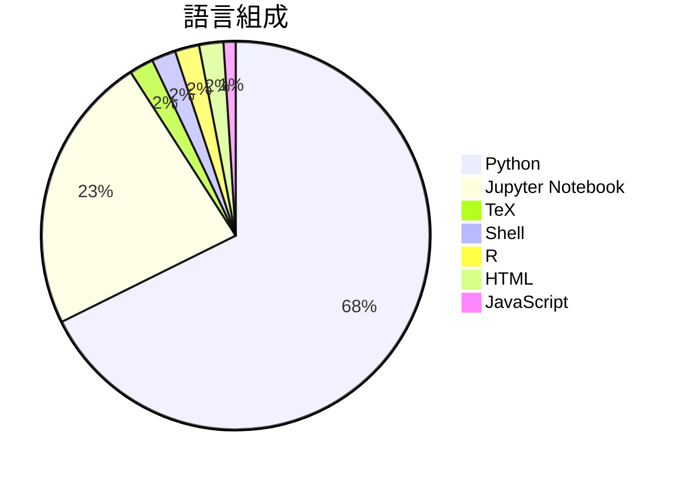

# OpenClaw-Medical-Skills

> [!summary] 一句話摘要
> OpenClaw的最大開源醫療AI技能庫。

## 專案簡介

這是一個專為醫療領域設計的開源AI技能庫，旨在提供醫療專業人員所需的各種技能和知識。它使用最新的AI技術來提升醫療訓練和實踐的效率，解決了傳統醫療教育資源不足的問題。獨特之處在於其開放性和可擴展性，讓更多的醫療專業人士能夠貢獻和使用這些資源。

## 為什麼值得關注

> [!tip] 爆紅原因
> 隨著AI在醫療領域的應用日益增多，這個專案吸引了大量關注，因為它提供了一個開放的平台來促進醫療技能的學習和分享。

**879** stars · **440** stars/天 · 建立 2 天前

## 適合誰使用

**目標受眾**：適合醫療專業人士、學生和研究人員。

> [!example] 使用場景
> - 醫學院學生用於學習和模擬醫療技能。
> - 醫療專業人員進行持續教育和技能提升。
> - 研究人員使用該庫來開發新的醫療AI應用。

## 技術細節

| 欄位 | 值 |
| --- | --- |
| 語言 | Python |
| 授權 | N/A |
| Stars | 879 |
| Forks | 104 |
| Issues | 2 |
| 建立日期 | 2026-03-08 |

### 語言組成

### 主要貢獻者

| 貢獻者 | Commits |
| --- | --- |
| [@WangRongsheng](https://github.com/WangRongsheng) | 12 |
| [@donglihe-hub](https://github.com/donglihe-hub) | 8 |
| [@wabyking](https://github.com/wabyking) | 1 |

## README 摘錄

> [!info]- 展開查看原文 README
> # OpenClaw Medical Skills
> 
> 
> 
> 
> 
> 
> 
> 
> **The largest open-source medical AI skills library for OpenClaw.**
> 
> *869 curated skills · Clinical · Genomics · Drug Discovery · Bioinformatics · Medical Devices*
> 
> [English](#) | [中文](README_zh.md)
> 
> ---
> 
> ## What Is This?
> 
> **OpenClaw Medical Skills** is a curated collection of **869 AI agent skills** covering the full spectrum of biomedical and clinical research. These skills are designed for [OpenClaw](https://github.com/MedClaw-Org) / [NanoClaw](https://github.com/MedClaw-Org) — Claude-based personal AI assistant frameworks — and transform a general-purpose AI agent into a powerful medical and scientific research companion.
> 
> Each sk

## 相關概念

[[醫療人工智慧]] · [[開源教育資源]] · [[技能庫]]

---

> [!question] 個人筆記
> _在此寫下你的想法、使用心得..._

## 出現記錄

- [[2026-03-10|2026-03-10]] — 首次收錄，879 stars
