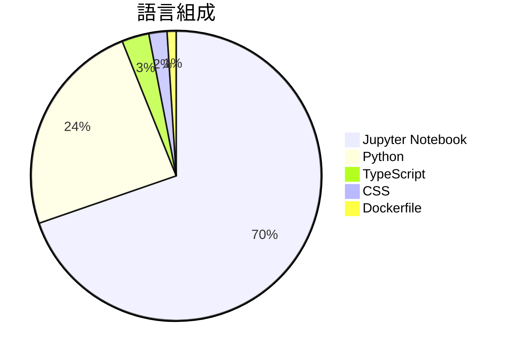

# TorchCode

> [!summary] 一句話摘要
> TorchCode 是一個針對 PyTorch 的練習平台，讓你從零開始實作各種深度學習技術。

## 專案簡介

TorchCode 提供了一個類似 LeetCode 的環境，專注於 PyTorch 的操作和架構實作。用戶可以練習實作 softmax、注意力機制、GPT-2 等技術，並享有即時自動評分的功能。這個平台特別適合想要提升機器學習面試技能的開發者，並且支援 Jupyter 環境，方便自我訓練。

## 為什麼值得關注

> [!tip] 爆紅原因
> 隨著機器學習的需求增加，許多人希望提升自己的技能以應對面試，TorchCode 剛好滿足了這個需求。

**1.5k** stars · **251** stars/天 · 建立 6 天前

## 適合誰使用

**目標受眾**：適合希望提升 PyTorch 技能的機器學習開發者。

> [!example] 使用場景
> - 準備機器學習面試，實作常見的 PyTorch 操作。
> - 在 Jupyter 環境中進行深度學習技術的實驗和測試。
> - 透過即時自動評分，快速了解自己的實作能力和進步空間。

## 技術細節

| 欄位 | 值 |
| --- | --- |
| 語言 | Jupyter Notebook |
| 授權 | N/A |
| Stars | 1.5k |
| Forks | 110 |
| Issues | 3 |
| 建立日期 | 2026-03-04 |
| 官方網站 | [Link](https://huggingface.co/spaces/duoan/TorchCode) |

### 語言組成

### 主要貢獻者

| 貢獻者 | Commits |
| --- | --- |
| [@duoan](https://github.com/duoan) | 28 |
| [@Ando233](https://github.com/Ando233) | 2 |
| [@ThierryHJ](https://github.com/ThierryHJ) | 1 |
| [@github-actions[bot]](https://github.com/github-actions[bot]) | 1 |

## README 摘錄

> [!info]- 展開查看原文 README
> ---
> title: TorchCode
> emoji: 🔥
> colorFrom: red
> colorTo: yellow
> sdk: docker
> app_port: 7860
> pinned: false
> ---
> 
> # 🔥 TorchCode
> 
> **Crack the PyTorch interview.**
> 
> Practice implementing operators and architectures from scratch — the exact skills top ML teams test for.
> 
> *Like LeetCode, but for tensors. Self-hosted. Jupyter-based. Instant feedback.*
> 
> 
> 
> 
> 
> 
> 
> 
> 
> 
> 
> 
> 
> ---
> 
> ## 🎯 Why TorchCode?
> 
> Top companies (Meta, Google DeepMind, OpenAI, etc.) expect ML engineers to implement core operations **from memory on a whiteboard**. Reading papers isn't enough — you need to write `softmax`, `LayerNorm`, `MultiHeadAttention`, and full Transformer blocks cod

## 相關概念

[[深度學習]] · [[神經網絡]] · [[自動評分系統]]

---

> [!question] 個人筆記
> _在此寫下你的想法、使用心得..._

## 出現記錄

- [[2026-03-10|2026-03-10]] — 首次收錄，1.5k stars
