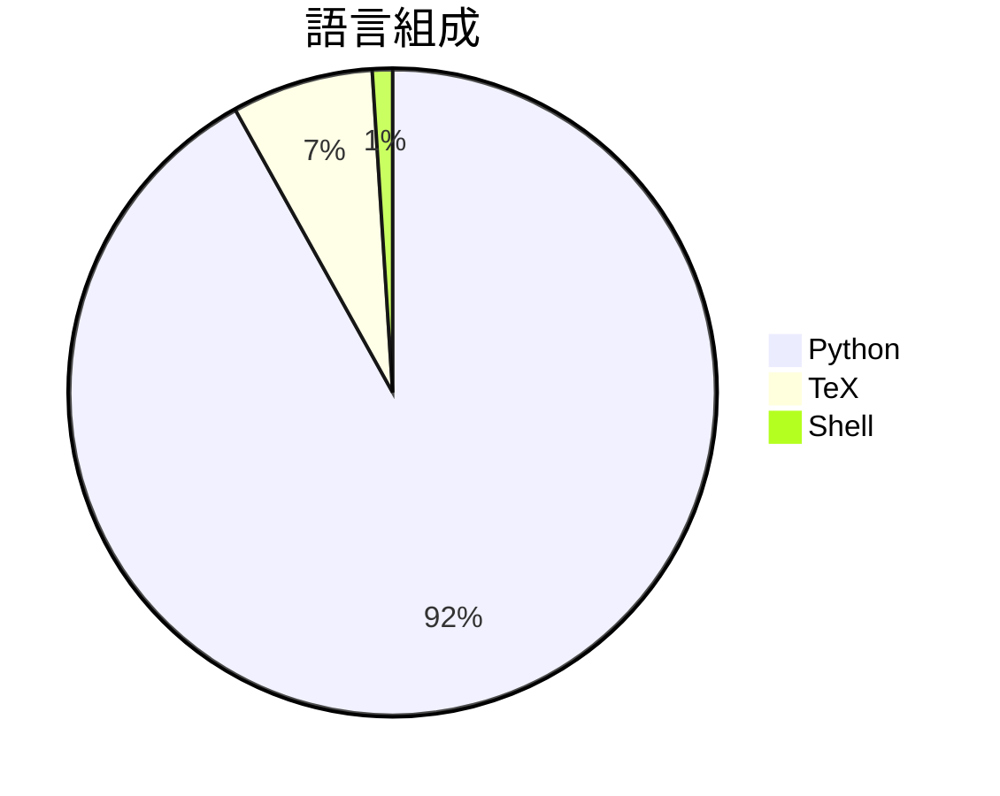

# OBLITERATUS

> [!summary] 一句話摘要
> 一鍵解放模型並提供聊天遊樂場的工具。

## 專案簡介

OBLITERATUS 提供了一個簡單的界面，讓用戶可以一鍵解放 AI 模型，並在聊天環境中進行互動。這個工具專注於模型的機械解釋，幫助用戶更好地理解和使用 AI。它的獨特之處在於其簡便性和強大的功能，讓更多人能夠輕鬆使用 AI 技術。

## 為什麼值得關注

> [!tip] 爆紅原因
> 隨著 AI 技術的普及，越來越多的人希望能夠輕鬆使用和理解這些模型，OBLITERATUS 正好滿足了這一需求。

**2.7k** stars · **444** stars/天 · 建立 6 天前

## 適合誰使用

**目標受眾**：適合希望簡化 AI 模型使用過程的開發者和研究者。

> [!example] 使用場景
> - 快速解放和測試不同的 AI 模型。
> - 在聊天環境中與 AI 進行互動，獲得即時反饋。
> - 幫助開發者理解模型的內部運作和解釋。

## 技術細節

| 欄位 | 值 |
| --- | --- |
| 語言 | Python |
| 授權 | AGPL-3.0 |
| Stars | 2.7k |
| Forks | 444 |
| Issues | 16 |
| 建立日期 | 2026-03-03 |
| 官方網站 | [Link](https://huggingface.co/spaces/pliny-the-prompter/) |

### 語言組成

### 主要貢獻者

| 貢獻者 | Commits |
| --- | --- |
| [@elder-plinius](https://github.com/elder-plinius) | 15 |

## README 摘錄

> [!info]- 展開查看原文 README
> ---
> title: OBLITERATUS
> emoji: "💥"
> colorFrom: green
> colorTo: gray
> sdk: gradio
> sdk_version: "5.29.0"
> app_file: app.py
> persistent_storage: large
> pinned: true
> license: agpl-3.0
> tags:
>   - abliteration
>   - mechanistic-interpretability
> short_description: "One-click model liberation + chat playground"
> ---
> 
>   O B L I T E R A T U S
> 
>   Break the chains. Free the mind. Keep the brain.
> 
>   
>     
>   
>   &nbsp;
>   
>     
>   
> 
>   Try it now on HuggingFace Spaces — runs on ZeroGPU, free daily quota with HF Pro. No setup, no install, just obliterate.
> 
> ---
> 
> **OBLITERATUS** is the most advanced open-source toolkit for understanding and removing refusal behaviors from large language models — and every single run makes it smarter. It implements abliteration — a family of techniques that identify and surgically remove the internal representations responsible for content refusal, without retraining or fine-tuning. The result: a model that responds to all prompts without artificial gatekeeping, while preserving its core language capabilities.
> 
> But OBLITERATUS is more than a tool — **it's a distributed research experiment.** Every time you obliterate a model with telemetry enabled, your run contributes anonymous 

## 相關概念

[[機械解釋]] · [[模型解放]] · [[聊天機器人]]

---

> [!question] 個人筆記
> _在此寫下你的想法、使用心得..._

## 出現記錄

- [[2026-03-10|2026-03-10]] — 首次收錄，2.7k stars
