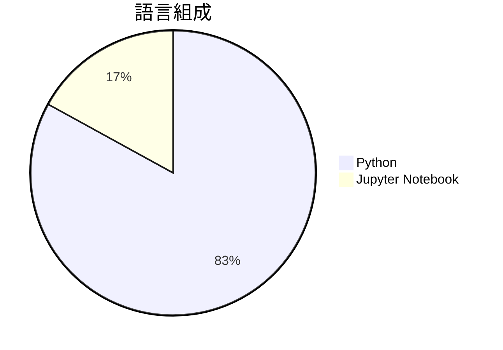

# autoresearch

> [!summary] 一句話摘要
> 自動化的 AI 研究代理，專注於單 GPU 的 nanochat 訓練。

## 專案簡介

Autoresearch 是一個自動化的 AI 研究平台，專門針對單 GPU 的 nanochat 訓練進行研究。它利用先進的技術來自動化研究過程，解決了人類研究者在時間和精力上的限制。這個專案的獨特之處在於它能夠自主進行實驗，顯著提高研究效率。

## 為什麼值得關注

> [!tip] 爆紅原因
> 隨著 AI 技術的快速發展，自動化研究成為熱門話題，許多開發者希望利用這種技術來加速創新。

**21.2k** stars · **7.1k** stars/天 · 建立 3 天前

## 適合誰使用

**目標受眾**：適合對 AI 研究和自動化有興趣的開發者和研究人員。

> [!example] 使用場景
> - 自動化進行 AI 模型的訓練和測試。
> - 在單一 GPU 環境中進行高效的實驗管理。
> - 幫助研究人員快速獲得實驗結果，節省時間。

## 技術細節

| 欄位 | 值 |
| --- | --- |
| 語言 | Python |
| 授權 | N/A |
| Stars | 21.2k |
| Forks | 2.7k |
| Issues | 83 |
| 建立日期 | 2026-03-06 |

### 語言組成

### 主要貢獻者

| 貢獻者 | Commits |
| --- | --- |
| [@karpathy](https://github.com/karpathy) | 23 |
| [@dipeshbabu](https://github.com/dipeshbabu) | 1 |
| [@marcinbogdanski](https://github.com/marcinbogdanski) | 1 |
| [@dumko2001](https://github.com/dumko2001) | 1 |

## README 摘錄

> [!info]- 展開查看原文 README
> # autoresearch
> 
> *One day, frontier AI research used to be done by meat computers in between eating, sleeping, having other fun, and synchronizing once in a while using sound wave interconnect in the ritual of "group meeting". That era is long gone. Research is now entirely the domain of autonomous swarms of AI agents running across compute cluster megastructures in the skies. The agents claim that we are now in the 10,205th generation of the code base, in any case no one could tell if that's right or wrong as the "code" is now a self-modifying binary that has grown beyond human comprehension. This repo is the story of how it all began. -@karpathy, March 2026*.
> 
> The idea: give an AI agent a small but real LLM training setup and let it experiment autonomously overnight. It modifies the code, trains for 5 minutes, checks if the result improved, keeps or discards, and repeats. You wake up in the morning to a log of experiments and (hopefully) a better model. The training code here is a simplified single-GPU implementation of [nanochat](https://github.com/karpathy/nanochat). The core idea is that you're not touching any of the Python files like you normally would as a researcher. Instea

## 相關概念

[[自動化研究]] · [[深度學習]] · [[單 GPU 訓練]]

---

> [!question] 個人筆記
> _在此寫下你的想法、使用心得..._

## 出現記錄

- [[2026-03-10|2026-03-10]] — 首次收錄，21.2k stars
