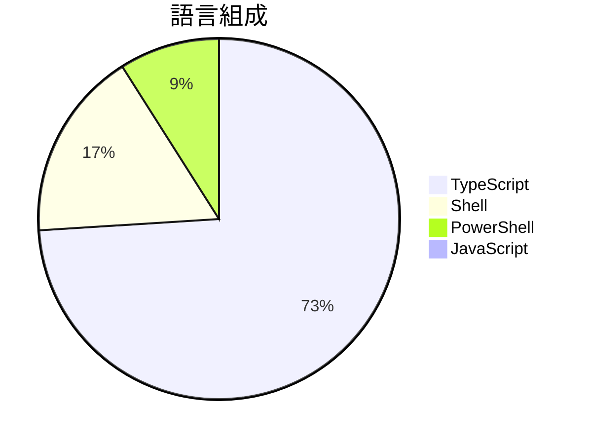

# Claude-to-IM-skill

> [!summary] 一句話摘要
> 將Claude代碼/ Codex橋接到即時通訊平台。

## 專案簡介

這個專案提供了一個橋接工具，讓用戶可以在Telegram、Discord、Feishu/Lark等即時通訊平台上與AI編程代理進行對話。它利用Claude的強大編程能力，解決了即時通訊中缺乏編程支持的問題。獨特之處在於其多平台兼容性，讓開發者能夠隨時隨地獲得編程幫助。

## 為什麼值得關注

> [!tip] 爆紅原因
> 隨著遠程工作和即時通訊的普及，開發者對於能夠隨時獲得編程支援的需求日益增加，這個專案因此受到關注。

**821** stars · **164** stars/天 · 建立 5 天前

## 適合誰使用

**目標受眾**：適合開發者和程式設計學習者。

> [!example] 使用場景
> - 開發者在即時通訊中尋求即時編程幫助。
> - 團隊協作時快速解決編程問題。
> - 學習者在聊天平台上進行編程練習和提問。

## 技術細節

| 欄位 | 值 |
| --- | --- |
| 語言 | TypeScript |
| 授權 | MIT |
| Stars | 821 |
| Forks | 105 |
| Issues | 35 |
| 建立日期 | 2026-03-05 |

### 語言組成



### 主要貢獻者

| 貢獻者 | Commits |
| --- | --- |
| [@op7418](https://github.com/op7418) | 3 |
| [@yoka1234](https://github.com/yoka1234) | 1 |

## README 摘錄

> [!info]- 展開查看原文 README
> # Claude-to-IM Skill
> 
> Bridge Claude Code / Codex to IM platforms — chat with AI coding agents from Telegram, Discord, Feishu/Lark, or QQ.
> 
> [中文文档](README_CN.md)
> 
> > **Want a desktop GUI instead?** Check out [CodePilot](https://github.com/op7418/CodePilot) — a full-featured desktop app with visual chat interface, session management, file tree preview, permission controls, and more. This skill was extracted from CodePilot's IM bridge module for users who prefer a lightweight, CLI-only setup.
> 
> ---
> 
> ## How It Works
> 
> This skill runs a background daemon that connects your IM bots to Claude Code or Codex sessions. Messages from IM are forwarded to the AI coding agent, and responses (including tool use, permission requests, streaming previews) are sent back to your chat.
> 
> ```
> You (Telegram/Discord/Feishu/QQ)
>   ↕ Bot API
> Background Daemon (Node.js)
>   ↕ Claude Agent SDK or Codex SDK (configurable via CTI_RUNTIME)
> Claude Code / Codex → reads/writes your codebase
> ```
> 
> ## Features
> 
> - **Four IM platforms** — Telegram, Discord, Feishu/Lark, QQ — enable any combination
> - **Interactive setup** — guided wizard collects tokens with step-by-step instructions
> - **Permission control** — tool calls require

## 相關概念

[[即時通訊集成]] · [[AI編程助手]] · [[多平台應用]]

---

> [!question] 個人筆記
> _在此寫下你的想法、使用心得..._

## 出現記錄

- [[2026-03-10|2026-03-10]] — 首次收錄，821 stars
