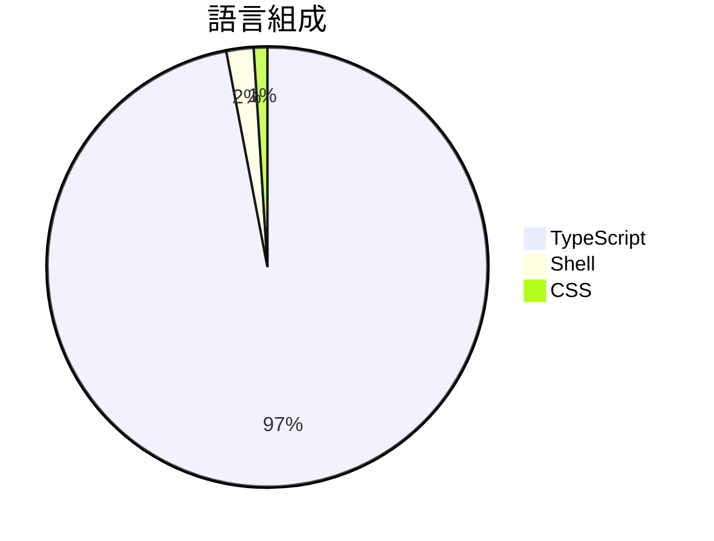

# Siftly

> [!summary] 一句話摘要
> Siftly 是一個本地化的 Twitter/X 書籤管理工具，具備 AI 分類和思維導圖視覺化功能。

## 專案簡介

Siftly 將 Twitter/X 的書籤轉換為可搜尋、可分類的視覺知識庫，並提供 AI 驅動的組織功能。用戶可以輕鬆導入書籤，進行分析、分類和探索，讓資訊管理變得更加高效和直觀。這個工具特別適合需要整理大量社交媒體資訊的用戶。

## 為什麼值得關注

> [!tip] 爆紅原因
> 隨著社交媒體內容的激增，許多用戶需要更好的工具來管理和組織他們的書籤。

**1.4k** stars · **226** stars/天 · 建立 6 天前

## 適合誰使用

**目標受眾**：適合需要管理大量社交媒體書籤的用戶。

> [!example] 使用場景
> - 將 Twitter/X 書籤整理成可搜尋的知識庫。
> - 使用 AI 分類功能，快速找到相關資訊。
> - 透過思維導圖視覺化書籤，提升資訊的可視性和組織性。

## 技術細節

| 欄位 | 值 |
| --- | --- |
| 語言 | TypeScript |
| 授權 | MIT |
| Stars | 1.4k |
| Forks | 112 |
| Issues | 7 |
| 建立日期 | 2026-03-04 |

### 語言組成



### 主要貢獻者

| 貢獻者 | Commits |
| --- | --- |
| [@viperrcrypto](https://github.com/viperrcrypto) | 57 |
| [@promptinprod](https://github.com/promptinprod) | 2 |
| [@baymac](https://github.com/baymac) | 2 |
| [@schizoidcock](https://github.com/schizoidcock) | 2 |
| [@robinlyu](https://github.com/robinlyu) | 1 |

### 最新版本

**v1.0.1** — Siftly v1.0.1 (2026-03-10)

## README 摘錄

> [!info]- 展開查看原文 README
> Siftly
> 
>   Self-hosted Twitter/X bookmark manager with AI-powered organization
> 
>   Import · Analyze · Categorize · Search · Explore
> 
>   
>     
>     
>     
>     
>     
>   
> 
> ---
> 
> ## What is Siftly?
> 
> Siftly turns your Twitter/X bookmarks into a **searchable, categorized, visual knowledge base** — running entirely on your machine. No cloud, no subscriptions, no browser extensions required. Everything stays local except the AI API calls you configure.
> 
> It runs a **4-stage AI pipeline** on your bookmarks:
> 
> ```
> 📥 Import (built-in bookmarklet or console script — no extensions needed)
>     ↓
> 🏷️  Entity Extraction   — mines hashtags, URLs, mentions, and 100+ known tools from raw tweet data (free, zero API calls)
>     ↓
> 👁️  Vision Analysis      — reads text, objects, and context from every image/GIF/video thumbnail (30–40 visual tags per image)
>     ↓
> 🧠 Semantic Tagging     — generates 25–35 searchable tags per bookmark for AI-powered search
>     ↓
> 📂 Categorization       — assigns each bookmark to 1–3 categories with confidence scores
> ```
> 
> After the pipeline runs, you get:
> - **AI search** — find bookmarks by meaning, not just keywords (*"funny meme about crypto crashing"*)
> - **Interactive mindmap** —

## 相關概念

[[書籤管理]] · [[人工智慧]] · [[視覺化工具]]

---

> [!question] 個人筆記
> _在此寫下你的想法、使用心得..._

## 出現記錄

- [[2026-03-10|2026-03-10]] — 首次收錄，1.4k stars
