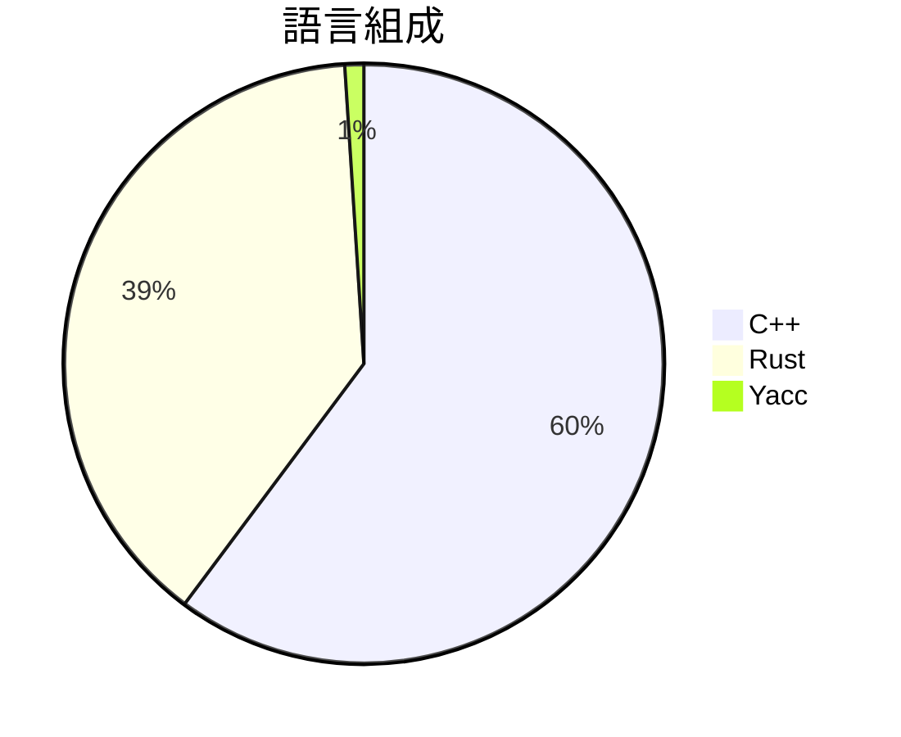

# vulhunt

> [!summary] 一句話摘要
> 一個由 Binarly 研究團隊開發的漏洞檢測框架。

## 專案簡介

VulHunt 是一個專為安全研究人員設計的漏洞檢測框架，旨在幫助識別軟體二進位檔和 UEFI 韌體中的漏洞。它基於 Binarly 的二進位分析技術，提供強大的分析能力，能夠幫助使用者快速找到潛在的安全問題。

## 為什麼值得關注

> [!tip] 爆紅原因
> 隨著網路安全問題日益嚴重，這個專案為安全研究人員提供了一個有效的工具來識別和修補漏洞，因此受到廣泛關注。

**536** stars · **134** stars/天 · 建立 4 天前

## 適合誰使用

**目標受眾**：適合安全研究人員和開發者。

> [!example] 使用場景
> - 對企業軟體進行安全評估。
> - 分析 UEFI 韌體以發現潛在漏洞。
> - 幫助安全專家進行漏洞研究和修補。

## 技術細節

| 欄位 | 值 |
| --- | --- |
| 語言 | C++ |
| 授權 | GPL-3.0 |
| Stars | 536 |
| Forks | 53 |
| Issues | 0 |
| 建立日期 | 2026-03-05 |
| 官方網站 | [Link](https://vulhunt.re) |

### 語言組成



### 主要貢獻者

| 貢獻者 | Commits |
| --- | --- |
| [@xorpse](https://github.com/xorpse) | 2 |

### 最新版本

**v1.0.0** — Release v1.0.0 (2026-03-07)

## README 摘錄

> [!info]- 展開查看原文 README
> # VulHunt Community Edition
> 
> VulHunt is a vulnerability hunting framework developed by Binarly's Research
> team. It is designed to help security researchers and practitioners identify
> vulnerabilities in software binaries and UEFI firmware. VulHunt is built on top
> of Binarly's Binary Analysis and Inspection System (BIAS), which provides a
> powerful and flexible environment for analysing and understanding binaries.
> VulHunt integrates with the capabilities of the Binarly Transparency Platform
> (BTP) to enable large-scale vulnerability management, hunting, and triage
> capabilities.
> 
> VulHunt Community Edition is a free and open-source version of the VulHunt
> engine within the BTP, designed to facilitate community-developed rulepacks and
> integrations.
> 
> ## Building (with cargo-make)
> 
> ### Prerequisites
> 
> ```bash
> cargo install cargo-make
> ```
> 
> ### Building
> 
> ```bash
> cargo make --profile  build
> ```
> 
> With support for Binary Ninja:
> 
> ```bash
> cargo make --profile  build --features=bndb
> ```
> 
> ### Installation
> 
> ```bash
> cargo make --profile  install
> ```
> 
> With support for Binary Ninja:
> 
> ```bash
> cargo make --profile  install --features=bndb
> ```
> 
> ## Building (without cargo-make)
> 
> ### Prerequisites
> 
> ```bash
> git

## 相關概念

[[漏洞檢測]] · [[二進位分析]] · [[UEFI 韌體]]

---

> [!question] 個人筆記
> _在此寫下你的想法、使用心得..._

## 出現記錄

- [[2026-03-10|2026-03-10]] — 首次收錄，536 stars
